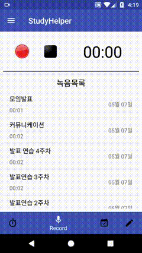

# StudyHelper ( 2018.04.02 ~ 2018.05.09 )

**Language**    : Java

**Environment** : MacOs, Android Studio

**Position**    : 1인 개발

**Library**     : Realm, Gson, RecyclerView, MPAndroidChart, VerticalViewPager, PhotoView, ClansFloatingActionButton
              
              
**목적** : 휴식시간을 제외한 실질적인 공부시간을 측정하여 공부패턴을 확인할 수 있는 어플

* * *

## [ 첫번째 탭 ] - 공부시간 측정

목표시간 설정을 통해 오늘 공부할 시간을 정한 후에 사용자는 버튼조작을 통해 타이머를 시작하거나 정지 시킬 수 있습니다.
타이머 시작상태에서 어플을 종료하고 다시 실행 하였을 때 자동으로 타이머의 시간이 흘러갑니다.
초기화버튼을 통해 목표시간 및 공부시간을 초기화 할 수 있고, 수정버튼을 통해서는 목표시간만 수정 가능합니다. 
(시연을 위해 목표시간의 최대값을 임의로 조정해놓은 상태입니다.)

* * *

## [ 두번째 탭 ] - 녹음기능

녹음버튼을 눌러서 녹음을 시작할 수 있습니다. 녹음이 시작되면 화면 오른쪽과 알림창에 녹음되고있는 시간을 표시
홈화면상태, 또는 어플이 꺼진상태에서도 녹음이 진행되며 알림창을 통해 녹음을 중지 시킬 수 있습니다.
녹음목록을 클릭시에 해당 파일을 재생할 수 있습니다.
* * *

## [ 세번째 탭 ] - 달력기능 & 공부시간 확인

위아래로 Swipe 기능이 있으며 FloatingActionButton을 통해 오늘 날짜로 이동 할 수 있습니다. 
ProgressBar에 매일 공부 한 정도가 표현이 되고, 클릭 했을시 목표시간 및 공부한 시간이 하단에 나타납니다. 
롱클릭 했을시에는 해당 날짜의 메모가 존재한다면 Dialog를 통해 메모 목록을 보여주고 메모를 선택하여 볼 수 있습니다.
* * *

## [ 네번째 탭 ] - 메모기능

FloatingActionButton을 통해 메모추가 및 삭제를 할 수 있습니다. 
메모 목록을 클릭할시에는 내용을 확인할 수 있는 창이 뜨며, 이미지를 클릭할 시 페이지형식으로 이미지를 확인 할 수 있습니다. 
또, 메모 안에서 수정 및 삭제가 가능합니다. 
삭제 버튼을 누르게되면 선택삭제가 가능합니다. 
검색어를 입력하여 메모를 찾을 수 있습니다. 
 
 * * *

## [ 드로어 탭 ] - 그래프기능

사용자가 공부한 시간을 일간, 주간, 월간 별로 확인 할 수 있습니다. 
